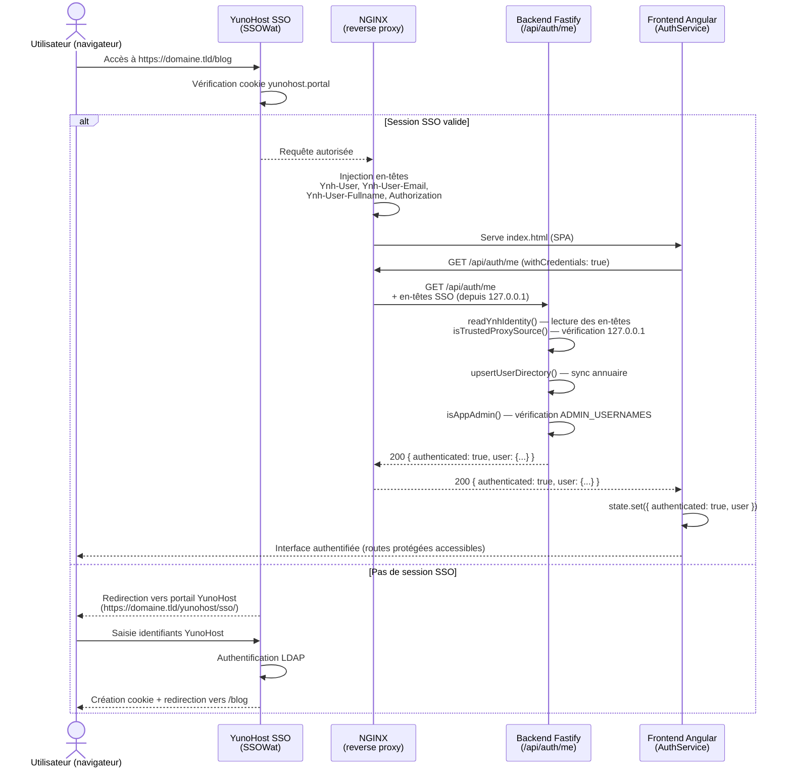

# Intégration SSO YunoHost

Ce document décrit le contrat technique entre YunoHost (SSOWat + NGINX), le backend Fastify et le frontend Angular pour l'authentification unique (SSO).

> **Voir aussi :** [`docs/API_SSO.md`](API_SSO.md) pour la spécification complète des endpoints API, et [`YUNOHOST_INTEGRATION.md`](../YUNOHOST_INTEGRATION.md) pour le déploiement du package YunoHost.

---

## Table des matières

1. [Vue d'ensemble](#1-vue-densemble)
2. [Contrat proxy → application (en-têtes SSO)](#2-contrat-proxy--application-en-têtes-sso)
3. [Structure de la réponse `GET /api/auth/me`](#3-structure-de-la-réponse-get-apiauthme)
4. [Flux d'authentification complet](#4-flux-dauthentification-complet)
5. [Variables d'environnement requises](#5-variables-denvironnement-requises)
6. [Test local sans YunoHost](#6-test-local-sans-yunohost)
7. [Dépannage](#7-dépannage)

---

## 1. Vue d'ensemble

YunoHost utilise **SSOWat** comme middleware SSO. Lorsqu'un utilisateur accède à l'application via le portail YunoHost :

1. SSOWat vérifie la session (cookie `yunohost.portal`).
2. NGINX transmet la requête à l'application en **injectant des en-têtes HTTP** avec l'identité de l'utilisateur.
3. Le backend Fastify lit ces en-têtes et **ne les accepte que si la connexion provient de `127.0.0.1`** (le proxy local).
4. Le frontend Angular interroge `GET /api/auth/me` pour connaître l'état de la session et adapter l'interface.

**Il n'y a pas de JWT ni de mécanisme de login/register dans l'application.** Toute la gestion des comptes se fait dans YunoHost.

---

## 2. Contrat proxy → application (en-têtes SSO)

### En-têtes injectés par SSOWat via NGINX

| En-tête HTTP (NGINX) | En-tête reçu par Node.js | Description |
|----------------------|--------------------------|-------------|
| `Ynh-User` | `ynh-user` | Identifiant (login) de l'utilisateur YunoHost |
| `Ynh-User-Email` | `ynh-user-email` | Adresse e-mail de l'utilisateur |
| `Ynh-User-Fullname` | `ynh-user-fullname` | Nom complet (display name) |
| `Authorization: Basic <base64>` | `authorization` | Fallback : Basic `username:password` (seul le username est utilisé) |

> **Note :** Node.js normalise tous les noms d'en-têtes en minuscules. La variante avec tiret bas (`ynh_user`) est aussi acceptée par le backend pour compatibilité avec certaines configurations NGINX.

### Règle de confiance (trust rule)

Le backend **n'accepte les en-têtes SSO que si la requête TCP provient de `127.0.0.1`** (le proxy local). Cette règle est contrôlée par la variable `TRUST_SSO_HEADERS` :

| Valeur | Comportement |
|--------|-------------|
| `auto` (défaut) | Fait confiance uniquement à `127.0.0.1` / `::ffff:127.0.0.1` / `::1` |
| `always` | Fait toujours confiance (utile en développement avec proxy externe) |
| `never` | Ignore toujours les en-têtes SSO (mode public forcé) |

### Fallback `Authorization: Basic`

Certaines versions de NGINX ne transmettent pas correctement les en-têtes avec tirets (`Ynh-User`). SSOWat injecte aussi `Authorization: Basic <base64(username:password)>` lorsque `auth_header` est activé. Le backend décode le champ username du Basic auth comme identifiant de secours.

### Configuration NGINX (extrait de `conf/nginx.conf`)

```nginx
location __PATH__/api/ {
    proxy_pass http://127.0.0.1:__PORT__/api/;
    proxy_set_header Ynh-User          $http_ynh_user;
    proxy_set_header Ynh-User-Email    $http_ynh_user_email;
    proxy_set_header Ynh-User-Fullname $http_ynh_user_fullname;
    proxy_set_header Authorization     $http_authorization;
    proxy_set_header Cookie            $http_cookie;
}
```

---

## 3. Structure de la réponse `GET /api/auth/me`

### Utilisateur non authentifié

```json
{
  "authenticated": false
}
```

### Utilisateur authentifié

```json
{
  "authenticated": true,
  "user": {
    "id": "jdupont",
    "email": "jdupont@domaine.tld",
    "name": "Jean Dupont",
    "role": "user"
  }
}
```

### Administrateur authentifié

```json
{
  "authenticated": true,
  "user": {
    "id": "admin",
    "email": "admin@domaine.tld",
    "name": "Administrateur",
    "role": "admin"
  }
}
```

### Correspondance avec les interfaces TypeScript (frontend)

Ces interfaces sont définies dans `src/app/core/services/auth.service.ts` :

```typescript
export interface AuthUser {
  id: string;       // uid YunoHost (en-tête ynh-user)
  email: string;    // en-tête ynh-user-email (chaîne vide si absent)
  name: string;     // en-tête ynh-user-fullname (fallback : uid)
  role: 'admin' | 'user'; // 'admin' si uid dans ADMIN_USERNAMES, sinon 'user'
}

export interface AuthState {
  authenticated: boolean;
  user?: AuthUser;
}
```

### Logique de détermination du rôle

Un utilisateur reçoit le rôle `admin` si et seulement si son identifiant YunoHost (`ynh-user`) figure dans la variable d'environnement `ADMIN_USERNAMES` (liste séparée par des virgules, points-virgules ou espaces).

Exemple : `ADMIN_USERNAMES=alice,bob` → `alice` et `bob` sont admins.

### Effet de bord : synchronisation du répertoire

À chaque appel à `/api/auth/me` authentifié, le backend effectue un **upsert** dans la table `user_directory` pour maintenir un annuaire local des utilisateurs connus de l'application (utilisé par les endpoints d'administration).

---

## 4. Flux d'authentification complet



### Déconnexion

Il n'y a pas d'endpoint de logout applicatif. Le client doit rediriger vers :

```
https://<domaine>/yunohost/sso/?action=logout
```

Le backend expose `POST /api/auth/logout` qui renvoie `204` (no-op) pour compatibilité ; c'est le client qui gère la redirection SSO.

### Guards Angular

| Guard | Type | Comportement en cas d'échec |
|-------|------|------------------------------|
| `authGuard` | `CanActivateFn` | Redirige vers `/401` si non authentifié |

---

## 5. Variables d'environnement requises

Ces variables sont définies dans `api/.env` (copié depuis `api/.env.example`) et écrites par les scripts d'installation YunoHost dans `api/.env` de l'instance déployée.

| Variable | Obligatoire | Défaut | Description |
|----------|-------------|--------|-------------|
| `NODE_ENV` | Non | `development` | `production` en déploiement YunoHost |
| `HOST` | Non | `127.0.0.1` | Adresse d'écoute de Fastify |
| `PORT` | Non | `3000` | Port d'écoute de Fastify |
| `ADMIN_USERNAMES` | **Oui** | _(vide)_ | Logins YunoHost ayant le rôle `admin` (séparés par virgules) |
| `TRUST_SSO_HEADERS` | Non | `auto` | `auto` \| `always` \| `never` |
| `DATABASE_HOST` | **Oui** | `127.0.0.1` | Hôte MariaDB |
| `DATABASE_PORT` | Non | `3306` | Port MariaDB |
| `DATABASE_USER` | **Oui** | `bookapp` | Utilisateur MariaDB |
| `DATABASE_PASSWORD` | **Oui** | _(vide)_ | Mot de passe MariaDB |
| `DATABASE_NAME` | **Oui** | `book_review_blog` | Nom de la base de données |

En production, les variables `DATABASE_*` et `ADMIN_USERNAMES` sont générées automatiquement par le script d'installation YunoHost (`scripts/install`).

---

## 6. Test local sans YunoHost

Le proxy de développement Angular (`proxy.conf.cjs`) **simule les en-têtes SSOWat** lors des appels à `/api`, permettant de tester l'intégration SSO sans instance YunoHost.

### Configuration par défaut

Sans variable d'environnement, le proxy injecte :

| En-tête injecté | Valeur par défaut |
|-----------------|-------------------|
| `ynh-user` | `devuser` |
| `ynh-user-email` | `dev@example.local` |
| `ynh-user-fullname` | `Dev User` |

### Personnalisation via variables d'environnement

```bash
# Simuler un utilisateur différent
export DEV_YNH_USER=alice
export DEV_YNH_USER_EMAIL=alice@example.local
export DEV_YNH_USER_FULLNAME="Alice Martin"
npm start
```

### Procédure complète de test local

```bash
# 1. Démarrer MariaDB
npm run db:up

# 2. Configurer l'API
cp api/.env.example api/.env
# Vérifier que ADMIN_USERNAMES=devuser (correspond à DEV_YNH_USER par défaut)

# 3. Installer les dépendances et migrer la base
cd api && npm ci && npm run migrate && cd ..

# 4. Démarrer l'API (terminal séparé)
npm run dev:api

# 5. Démarrer le frontend (terminal séparé)
npm start

# 6. Ouvrir http://127.0.0.1:4200/
```

### Tester le rôle admin

```bash
# Modifier api/.env
ADMIN_USERNAMES=devuser

# Ou via variable au démarrage du frontend
DEV_YNH_USER=monlogin npm start
# et dans api/.env : ADMIN_USERNAMES=monlogin
```

### Test avec `TRUST_SSO_HEADERS=always`

Si le frontend et l'API tournent dans des configurations où `127.0.0.1` n'est pas l'adresse source (ex : Docker bridge), ajouter dans `api/.env` :

```
TRUST_SSO_HEADERS=always
```

> ⚠️ **Ne jamais utiliser `TRUST_SSO_HEADERS=always` en production** : cela permettrait à n'importe qui de forger une identité SSO en envoyant les en-têtes directement.

---

## 7. Dépannage

### `authenticated: false` alors que l'utilisateur est connecté

**Causes possibles :**

1. **L'API ne reçoit pas les en-têtes SSO.** Vérifier la configuration NGINX (`conf/nginx.conf`) : les directives `proxy_set_header Ynh-User` doivent être présentes dans le bloc `location __PATH__/api/`.

2. **La requête ne vient pas de `127.0.0.1`.** Si `TRUST_SSO_HEADERS=auto` (défaut), le backend rejette les en-têtes si l'adresse TCP source n'est pas le loopback. Vérifier les logs Fastify pour l'adresse source.

3. **Variante d'en-tête non reconnue.** Certaines versions de NGINX transforment les tirets en tirets bas (`Ynh_User`). Le backend accepte les deux variantes, mais vérifier les logs pour voir les en-têtes reçus.

4. **Fallback Basic échoue.** Vérifier que `auth_header` est activé dans la configuration SSOWat et que `Authorization` est bien transmis par NGINX (`proxy_set_header Authorization $http_authorization`).

### L'utilisateur voit `/401` au lieu du contenu

L'`authGuard` a reçu `{ authenticated: false }` de `GET /api/auth/me`. Voir le point précédent. Vérifier aussi que la session YunoHost est active (cookie `yunohost.portal` présent dans le navigateur).

### L'utilisateur authentifié ne voit pas les routes admin

La vérification du rôle `admin` est effectuée côté backend via `ADMIN_USERNAMES`. Vérifier que :
- Le login de l'utilisateur figure dans `ADMIN_USERNAMES` dans `api/.env`.
- L'API a été redémarrée après modification de `api/.env`.

### `GET /api/auth/me` retourne `404` ou `502`

- `404` : le prefix de route est incorrect. Vérifier `environment.apiUrl` et la configuration NGINX.
- `502` : l'API Fastify ne tourne pas ou n'écoute pas sur le port attendu. Vérifier `PORT` dans `api/.env` et le service systemd (`journalctl -u book-review-blog -f`).

### En développement local, l'API renvoie `{ authenticated: false }`

Vérifier que :
1. L'API tourne bien sur le port 3000 (`npm run dev:api`).
2. Le frontend utilise `npm start` (et non `ng serve` directement) pour que le proxy injecte les en-têtes.
3. `TRUST_SSO_HEADERS` n'est pas à `never` dans `api/.env`.
